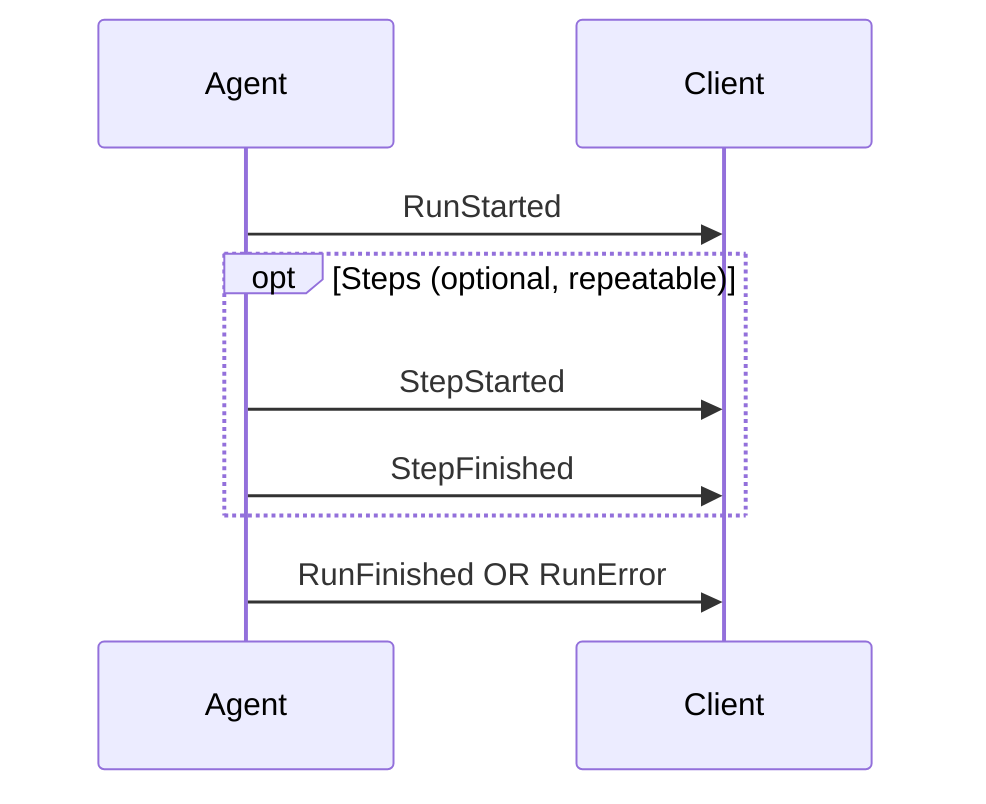

# AG-UI Integration Patterns & Gotchas

## 1. React/TypeScript Integration Best Practices

### Core SDK Packages

```typescript
// Core packages for TypeScript/JS clients
import { HttpAgent } from "@ag-ui/client"
import { EventType } from "@ag-ui/core"
```

### Event Handler Pattern

Register handlers for each event type you need:

```typescript
await agent.runAgent(
  {},
  {
    onTextMessageStartEvent() {
      // Initialize message UI
    },
    onTextMessageContentEvent({ event }) {
      // Append delta to message content
      process.stdout.write(event.delta)
    },
    onTextMessageEndEvent() {
      // Finalize message, enable reply controls
    },
    onToolCallStartEvent({ event }) {
      // Show tool invocation notification
    },
    onToolCallArgsEvent({ event }) {
      // Stream arguments as they're generated
    },
    onToolCallEndEvent() {
      // Prepare for result
    },
    onToolCallResultEvent({ event }) {
      // Display tool output
    },
    onRunFinishedEvent() {
      // Finalize UI state
    },
    onRunErrorEvent({ event }) {
      // Display error message
    }
  }
)
```

### Key Event Patterns

**Text Streaming (Start-Content-End)**:
1. `TextMessageStart` - Initialize message with `messageId`
2. `TextMessageContent` - Append `delta` chunks
3. `TextMessageEnd` - Finalize message

**Tool Calls (Start-Args-End-Result)**:
1. `ToolCallStart` - Establish `toolCallId`
2. `ToolCallArgs` - Stream argument deltas
3. `ToolCallEnd` - Signal completion
4. `ToolCallResult` - Receive execution output

**State Sync (Snapshot-Delta)**:
1. `StateSnapshot` - Full state replacement
2. `StateDelta` - JSON Patch operations (RFC 6902)

---

## 2. Common Issues with Event Streaming

### Event Ordering & Sequencing

⚠️ **GOTCHA**: Events must be processed in order received

- Events with the same ID (`messageId`, `toolCallId`) belong to the same logical stream
- Implementations should be resilient to out-of-order delivery
- Always concatenate deltas in order received

### Chunk Convenience Events

AG-UI provides convenience events that auto-expand:

```typescript
// TextMessageChunk expands to: Start → Content → End
// First chunk needs messageId, role defaults to "assistant"

// ToolCallChunk expands to: Start → Args → End
// First chunk needs toolCallId and toolCallName
```

### Transport Layer Issues

**SSE-Specific**:
- AG-UI provides typed events on top of SSE
- Events arrive as SSE data events
- Connection drops require reconnection logic

**WebSocket-Specific**:
- AG-UI handles message framing and sequencing
- Bi-directional communication supported
- Fallback handling needed for connection failures

### Lifecycle Completeness

⚠️ **GOTCHA**: Every run MUST produce:
- `RunStarted` (first event)
- `RunFinished` OR `RunError` (last event)

Step events are optional but recommended:


---

## 3. Integrating with Existing SSE/WebSocket Infrastructure

### AG-UI Transport Flexibility

AG-UI is transport-agnostic:
- Works with **any event transport** (SSE, WebSockets, webhooks, etc.)
- Allows **loose event format matching**
- Ships with **reference HTTP implementation**

### Architecture Pattern

```
Frontend (Application) <--> AG-UI Client <--> Agent Backend
```

### Co-existence with Existing Infrastructure

**AG-UI + REST APIs**:
```typescript
// AG-UI handles agent interactions
// REST handles CRUD operations
// Separation of concerns maintained
```

**AG-UI + MCP**:
```
User --> AG-UI --> Frontend
              |
              v
         MCP Tools
              |
              v
         External APIs
```

**AG-UI + A2A (Multi-Agent)**:
```
User --> AG-UI Client --> Agent
                      |
                      v
              A2A Protocol --> Sub-agents
```

### Raw Event Passthrough

For external systems, use `Raw` events:
```typescript
{
  type: "RAW",
  event: { /* external event data */ },
  source: "external-system-id"
}
```

### SSE to AG-UI Bridge

If you have existing SSE infrastructure:
1. Parse incoming SSE events
2. Map to AG-UI event types
3. Use AG-UI client to handle the mapped events

### WebSocket Considerations

AG-UI on WebSockets provides:
- Bi-directional communication
- Lower latency for interactive applications
- Automatic reconnection handling (implement at app level)

---

## 4. Debugging & Troubleshooting

### AG-UI Dojo

Use the [AG-UI Dojo](https://dojo.ag-ui.com/) for:
- Learning AG-UI capabilities
- Testing implementations against reference
- Step-by-step demonstration of each building block

### Common Debugging Patterns

1. **Event Sequence Issues**: Verify events emitted in correct order
2. **Data Format Problems**: Check event payloads match expected structure
3. **Transport Layer Debugging**: Verify SSE/WebSocket correctly delivers events
4. **State Synchronization**: Confirm snapshots and deltas applied correctly
5. **Tool Execution**: Verify tool calls and responses properly formatted

### Event Type Reference

| Category | Events |
|----------|--------|
| Lifecycle | `RunStarted`, `RunFinished`, `RunError`, `StepStarted`, `StepFinished` |
| Text | `TextMessageStart`, `TextMessageContent`, `TextMessageEnd`, `TextMessageChunk` |
| Tool | `ToolCallStart`, `ToolCallArgs`, `ToolCallEnd`, `ToolCallResult`, `ToolCallChunk` |
| State | `StateSnapshot`, `StateDelta`, `MessagesSnapshot` |
| Activity | `ActivitySnapshot`, `ActivityDelta` |
| Reasoning | `ReasoningStart`, `ReasoningMessageStart`, `ReasoningMessageContent`, `ReasoningMessageEnd`, `ReasoningEnd`, `ReasoningEncryptedValue` |
| Special | `Raw` (external passthrough), `Custom` (application-specific) |

---

## 5. Key Gotchas Summary

| Issue | Gotcha |
|-------|--------|
| Event ordering | Process events in order received, concatenate deltas in sequence |
| Lifecycle completeness | Must have `RunStarted` + (`RunFinished` OR `RunError`) |
| Chunk events | Auto-expand to Start-Content-End; first chunk needs ID |
| State sync | Use Snapshot for full replacement, Delta for incremental JSON Patch |
| Transport flexibility | AG-UI works over SSE, WebSockets, or any streaming transport |
| Custom events | Use `Custom` events for app-specific extensions |
| Raw passthrough | Use `Raw` events to wrap external system events |
| TypeScript | Use `@ag-ui/client` and `@ag-ui/core` packages |
| Deprecated | `THINKING_*` events renamed to `REASONING_*` (see migration guide) |

---

## Resources

- Documentation: https://docs.ag-ui.com
- AG-UI Dojo: https://dojo.ag-ui.com
- GitHub: https://github.com/ag-ui-protocol/ag-ui
- Discord: https://discord.gg/Jd3FzfdJa8
